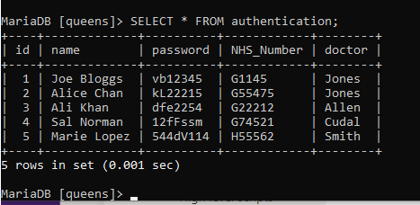

# 1. Background
## 1.1 Aims and objectives
The aim of this Python project is to use Object-Orientated Programming in mitigating a security issue for an appointment and scheduling management system (ASMIS) of Queens Medical Centre. The ASMIS is a cloud-based software as a service (Saas) and can be access through mobile and desktop devices. The ASMIS contains basic information related to patient’s registration details, appointments and preferred medical specialist as well as the medical clinic’s administrative staff who maintain the availability and scheduling of the medical specialists. Although the patient’s and clinic’s core information and records are isolated from AMSIS, threat actors can obtain user's Personal Identifiable Information (PII).

## 1.2 Threats
The main threats to the ASMIS are to use HTTPS spoofing and IDN homograph attacks to fake the ASMIS landing page with a login portal that can harvest user’s credentials as well as brute force attacks on the password Login to gain access. To mitigate these threats, Phillips (2018) advises to implement two classes for web login which will help validate the password and username combination.

1. Authenticator class: ensuring the user is who they say they really are.
2. Authorizer class: ensuring the authenticated user has correct access to certain functions.

However, this programme will focus on authentication as it only relates to registering and logging in of patient’s username and password.


## 2. Passwords and hashing
When dealing with passwords, there are various elements that need to be considered such as password complexity, length, history, expiration date, and encryption. The authenticator class looks at password encryption, password length and complexity.

* If len(password) < 5	= 			password must be six or more characters
* If not any(char.isdigit()	 = 		password must have at least one numeral
* If not any(char.isupper()	 =		password must have one uppercase letter
* If not any(char.islower()	 =		password must have one lowercase letter


The below examples shows if a user inputs a password of less than five characters it will be rejected, and it must include an alpha-numeric password with a lower and upper letter. For example, ‘g1234’ would be rejected, whereas ‘Ab4521421’ would be accepted. 


Once a user signs up with a username and password, it is stored in the patient’s text file. Here, it is stored in string text which can be easily read if accessed by a threat actor. To improve the security and confidentiality of the patient’s PII, the user class uses the imported Hashlib library to encode the password string. The Hashlib takes the user’s password and hashes it using sha256 constructor which results in a hash value.

```html
hashedpassword = hashlib.sha256(Password.encode()).hexdigest()

file.write(Username + "," + hashedpassword)
    file.write(",")
    file.write(hashedpassword)

```
For example, a password would be hashed into the following value:
```html
Input: Jonny123
Output: c4b151277ecbb605282699f245ddb75ab0f7f8fa45f38f2255e92219d08d90e9
```

Another useful feature to mitigate against brute force attacks is the time-related imported dependency ‘time’. This is used in the Login function to after a user has incorrectly inputted the password. It can be set to a different duration depending on the threat level. The time setting for this function is 3 seconds. It is worth noting that a longer setting may deter threat actors but also patients!

```html
time.sleep(3)
```


## 3. Patient’s username and password database
This task uses a standard text file for storing patient’s username and hashing password for simplicity (see Figure 2), whereas in real-life environment such data would be stored on a database server. To better reflect a real-life scenario, I set up a Mysql server on my Raspberry Pi (see Figure 3). The Queens Medical Centre (queens_mc) database shows a sample of an unhashed  patient registration table consisting of name, password, NHS number, and doctor(specialist).

> joe bloggs , vb123456 
#### Figure 2. A sample of the  patient’s raw data in a text file.  
  

#### Figure 3. A representation of the patient’s raw data in a Mysql database.  


## 4. Dependencies
This programme is using two dependencies:
1.	Hashlib from https://docs.python.org/3/library/hashlib.html
2.	Time from https://docs.python.org/3/library/time.html

## 5. Authentication module
### 5.1 Welcome
This Welcome function was adapted from Archibald (2021) and commences the programme.

```html
def Welcome():
# This function displays a landing page welcoming users to Queens Medical Centre and gives guidance on next steps to be taken.
print("Welcome to Queens Medical Centre")
print("Please choose one of the following to access the appointment and scheduling system")


# User selects which option they prefer.
print("Select 1 to Register")
print("Select 2 to Login")
print()

# As this is simple 1/0 logic operator, the Boolean returns the value True.
while True:
    print()
user = input(" Input your selection here: ")
if user in ['1', '2']:
    break 
if user == '1':
    Register()
else:
    Login()
```

### 5.2 Registration
This section gives comments for the register function.
```
def Register():
print("Welcome to Queens Medical centre registration portal")

# User inputs name and password if first time using system.
Username = input("Please input your name: ")
Password = input("Please input your password: ")

# Starts the hash dependency for password hashing
hashedpassword =hashlib.sha256(Password.encode()).hexdigest()print("Password:" + Password)


# Sets conditions for password validation. If conditions are not met, then user is routed back to landing page.
# Password must be five or more characters.
if len(Password) < 5:
    print('length should be at least 5')
    val = False   

# Password must have at least one numeral.
if not any(char.isdigit() for char in Password):
    print('Password should have at least one numeral')
    val = False

# Password must have one uppercase letter.
if not any(char.isupper() for char in Password):
    print('Password should have at least one uppercase letter')
    val = False

# Password must have one uppercase letter.
if not any(char.islower() for char in Password):
    print('Password should have at least one lowercase letter')
    val = False

# This function opens the text file to add new users’ username and hashed password.
file = open(“Patient_database.txt", "r")

# This function compares users’ username and password against the registered users’ credentials. If already registered, output will state ‘You are already registered’.
for f in file:
    if Username in f:
        print("You are already registered")

        Welcome()

# If the user is already registered then they will be returned to the landing page to restart process.
        Return
        
# Password is hashed to file.       
file.close()
file = open("Patient_database.txt", "a")
file.write(Username + "," + hashedpassword)file.write(",")
file.write(hashedpassword)file.write("\n")
file.close()

# If newly registered and no exceptions raised, then output will state ‘Your details have been entered’.
print("Your details have been entered")

Welcome()
```

## 5.3 Login
This section gives comments for the Login function.
```
def Login():

# Welcome message asking for users’ name and password.
print("Welcome to Queens Medical centre login portal")
Username = input("Please input your name: ")
Password = input("Please input your password:")

# Starts the hash dependency for password decrypting.
hashedpassword =hashlib.sha256(Password.encode()).hexdigest()print("Password:" + Password)

# This function opens the text file and compares against the registered users’ credentials.
with open ("Patient_database.txt", "r") as file:
    for line in file:line = 
    line.strip().split()
if line[0] == Username and line[1] == hashedpassword:

# If the users’ username and password are already registered, then output will state ‘You are now logged in’.
    print(" You are now logged in")
    return True

# If there is an input error or the user has not been previously registered, then output will state ‘Sorry, your credentials are incorrect’.
print("Sorry, your credentials are incorrect")

# This time dependency has a three second duration before user can take the next step.
time.sleep(3)

# This returns the user to the landing page to restart the process.
return 
False

Welcome()
Register()
Login()
```

## 6. Testing
This section focuses on testing of the programme and any errors that occur.

<br></p>

In this example, the user has inputted a four-digit numeric password and programme has flagged invalid permissions of length, uppercase letters, and lowercase letters.<br></p>

<br></p>
 
In this example, the user has inputted the appropriate text that meets the password validations, and the programme accepts the username and password.<br></p>

<br></p>

The user’s username and password are entered in Patients_database file, and the password is hashed.<br></p>

<br></p>

This example shows if the user attempts to register a second time with same credentials. The programme rejects the credentials with an ‘You are already registered’ statement which routes the user to the landing page.<br></p>

<br></p>

This example shows if the same user logs in with registered credentials. The programme accepts the credentials and returns a ‘ You are now logged in’ statement.<br></p>

<br></p>

The user has inputted an incorrect password consequently the programme rejects the credentials with a ‘Sorry, your credentials are incorrect’ statement and restarts the login process after a three second delay.<br></p>


## 7. References

* Archibald, J. (2021) Skyjaheim2/Login-System. GitHub. Available from: https://github.com/Skyjaheim2/Login-System/blob/master/login.py [Accessed 17 Feb. 2022].
Docs.python.org. (2022) Hashlib — Secure hashes and message digests — Python 3.8.4rc1 documentation. Available from: https://docs.python.org/3/library/hashlib.html [Accessed 14 Feb. 2022].
* Fromaget, P. (2022) How to Learn to Program in Python with a Raspberry Pi? Raspberry tips. Available from: https://raspberrytips.com/python-tutorial-raspberry-pi/ [Accessed 22 Jan. 2022].
* GeeksforGeeks (2019) Password validation in Python - GeeksforGeeks. Available from: https://www.geeksforgeeks.org/password-validation-in-python/ [Accessed 9 Feb. 2022].
* Phillips, D. (2018) Python 3 object-oriented programming: build robust and maintainable software with object-oriented design patterns in Python 3.8. Birmingham, UK: Packt Publishing.
* Python.org. (2000) time — Time access and conversions — Python 3.7.2 documentation. Available from: https://docs.python.org/3/library/time.html [Accessed 15 Feb. 2022].
* Python, R. (2022) Object-Oriented Programming (OOP) in Python 3 – Real Python. realpython.com. Available from: https://realpython.com/python3-object-oriented-programming/ [Accessed 8 Feb. 2022].
